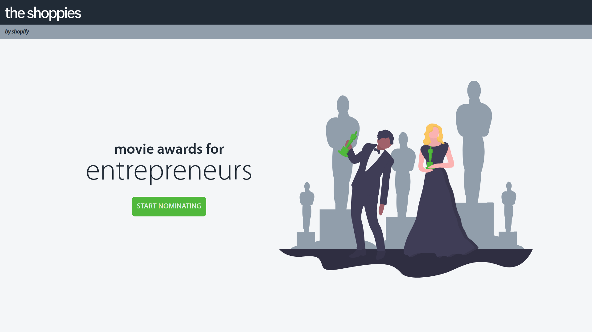
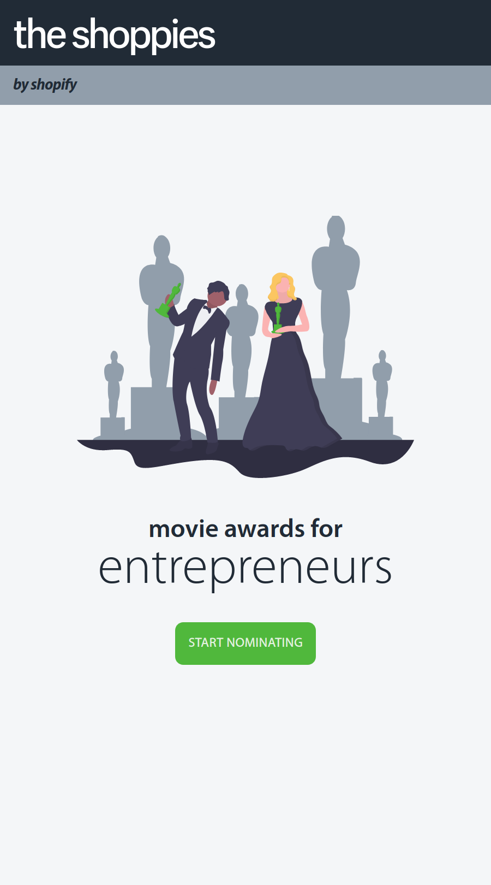
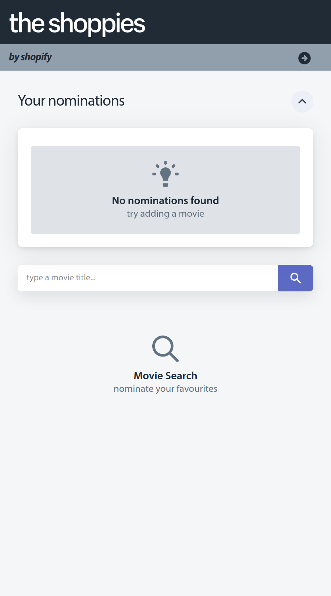
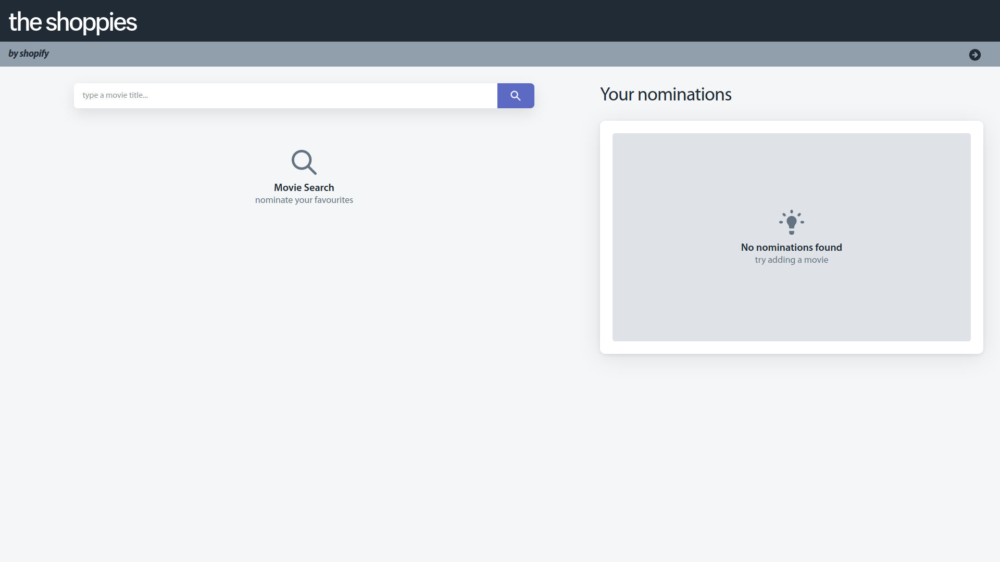
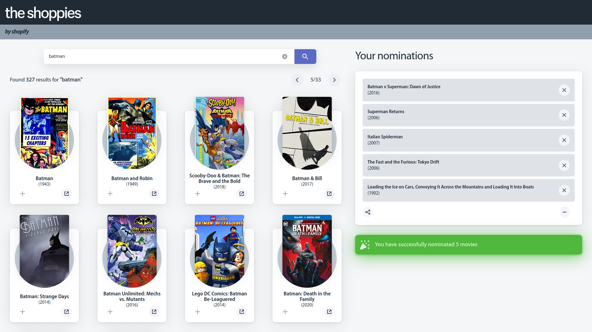

#### navn-r x shopify presents...

<h2 align="center"><strong>the shoppies</strong> 🎥🍿</h2>
<h3 align="center">movie awards for entrepreneurs</h5>

---


<h5 align="center"><em>landing page (1920x1080)</em></h5>

<br />

> This project was developed for the [Shopify UX & Web Developer Intern Challenge Summer 2021](https://jobs.smartrecruiters.com/ni/Shopify/ee14b4f1-62ec-4a47-850b-2311c57f855b-front-end-developer-intern-remote-summer-2021)

<br />

You can view the application live **[here](https://navn.me/the-shoppies)**

<br />

## [Technical Requirements](https://docs.google.com/document/d/1AZO0BZwn1Aogj4f3PDNe1mhq8pKsXZxtrG--EIbP_-w/edit#heading=h.l4jllv59h2hm)

1. Search results should come from OMDb's API (free API key: http://www.omdbapi.com/apikey.aspx).  
 
2. Each search result should list at least its title, year of release and a button to nominate that film.  
 
3. Updates to the search terms should update the result list.  
 
4. Movies in search results can be added and removed from the nomination list.  
 
5. If a search result has already been nominated, disable its nominate button.  
 
6. Display a banner when the user has 5 nominations.  

<br />


## Extra Features

As the title suggests, the following features were not *mandatory* per say, but this is **_shopify_** we're talking about, so its basically implied that implementing more features is a must.

- Create and share **generated links** of your nominations list, automatically copied to clipboard
  ```
  https://navn.me/the-shoppies/nominate/?n=tt0372784&n=tt2975590&n=tt0096895&n=tt0103776&n=tt1569923
  ```
  _you can generate links as long as you have **at least one** nomination in your list_

- **Automatic saving of user nominations**; will not get wiped after user leaves the page
  - This was implemented with `localStorage`, but could have alternatively been implemented with `IndexedDB` or any non-browser-based database such as Firebase or MongoDB 

- Addition of a **landing page**, with a following nomination/main page

- **Fully Responsive** with a minimum optimized screen width of 600px

- **Pagination** of movie search results
  - The API had this feature natively and this was fairly straightforward to implement client-side
  - However I haven't really seen this done in the majority of submissions I saw, but I digress

## Built using...

- **Angular 10** for main development (HTML/CSS/TS)
  - Purposefully built without a component library and chose to style all components from scratch. Big pain but well worth the effort imo
  
- **TravisCI** for continuous deployment [](https://travis-ci.com/navn-r/the-shoppies)
  - Thankfully I already did a small [project](https://github.com/navn-r/gh-search) trying to learn Angular with gh-pages for hosting, so it was almost trivial to adapt that config file for this project
  
- **Github Pages** for hosting

- **Shopify Polaris** for main color pallette, icons, and overall design guidelines (wasn't very strict on following this)
  - [These notes on color](https://polaris.shopify.com/design/colors#navigation) really motivated/inspired my design, box shadow on the application was also taken from those notes as well
  - *Fun fact*, my design for the movie card component was mainly inspired by this picture I found on the Polaris Design notes

  
  <h5 align="center"><em>https://polaris.shopify.com/bundles/2e0413ee61864d069098ae8ef0f6fdef.png</em></h5>

<br />

- **ShopifySans** and **Myriad Pro** for the main fonts
  - These, unsurprisingly, complimented each other very well

- **unDraw** for the landing page image

<br/>

## Cool things I learned

- [Securing Environment Variables with Angular](https://medium.com/better-programming/how-to-secure-angular-environment-variables-for-use-in-github-actions-39c07587d590)
  - I was more than familiar with using `.env` for secure keys in a backend node application, but it was interesting to see this on frontend
  - Their proposed implementation can be found in `src/assets/scripts/setEnv.ts`
  - Also, it was very easy to adapt this for use with TravisCI
  - For the OMDb API however this really isn't necessary since you pass the API key in the url, but still a good learning experience

- Debouncing API Calls upon change to user input
  - Some submissions I saw were sending an API call after every single key press, and since the API had a limit of 1000 daily, I saw this as an issue 
  - I was quite surprised on how easy this was to implement
    ```ts
    constructor() {
      // 500ms debounce time on input, modelChange is an rxjs Subject 
      this.modelChange.pipe(debounceTime(500)).subscribe(() => this.onSearch.emit(this.searchText));
    }
    ```

## Closing Notes & Screenshots

As mentioned earlier in this long readme, this application is deployed at https://navn.me/the-shoppies for everyone to try and use. I have also made the project board public, so check there for any new features being developed for this project. Thank you for making it this far 💯.

With that being said, I give you, **_screenshots_** (`docs/images/**.png`)

<span>


</span>

<br />

<h5 align="center"><em>landing (left) and empty main pages (right) (600x1080)</em></h5>

<br />



<h5 align="center"><em>main page with 0 nominations and no search results (1920x1080)</em></h5>

<br />


<h5 align="center"><em>main page with 5 nominations and search results (1920x1080)</em></h5>